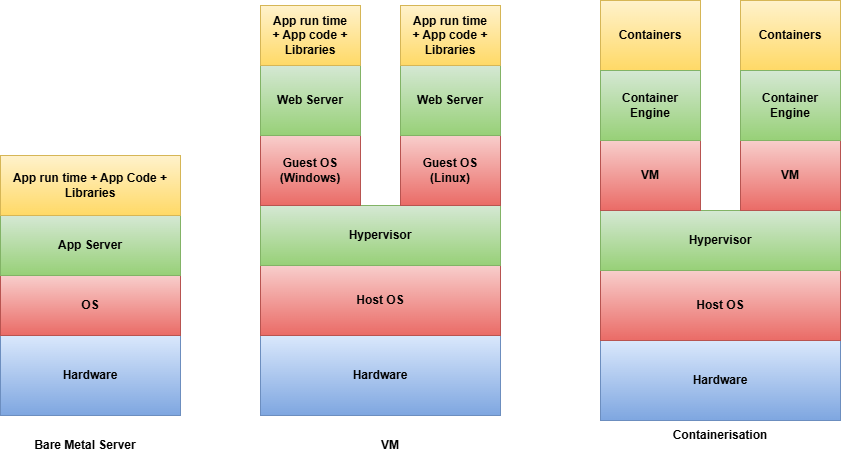

# DOCKER DEEP DIVE

## Introduction

Docker is a containerization platform that helps developers build, package and run applications in a consistent environment.

Before Docker, developers faced many issues:
- system differences
- dependency conflicts
- Deployment problems
- Production failures 
Docker was introduced to solve these problems.

### Problem 1:
One of the most common problems in software development was:
- The application works on the developers system but fails on the testing or production server.
This happened because:
- Different Operating System Versions
- Different Programming language versions
- Different library versions
- Missing system dependencies
Even a small version difference could break the application

### Problem 2:
Dependency Conflicts
Application require specific versions of:
- Programming languages (Node.js, Python, Java)
- Libraries
- Databases
- System packages
Managing multiple versions manually was complex and risky.

### Problem 3:
Before Docker, the main solution was Virtual Machines (VMs).
VMs required:
- A full Operating System
- Separate memory allocation
- Large storage space
Each VM was heavy and slow to start.
Running multiple applications required multiple VMs, which consumes a lot of resources.

## How Docker Solves these Problems

Docker introduces containers.

A container includes.
- Application
- Dependencies
- Required libraries
- Runtime
But it shares the host systems OS kernel.

This makes containers:
- Light weight
- Fast
- Portable
- Efficient

Docker solves the problem of inconsistent environments and dependency conflicts by packaging applications and their dependencies into lightweight, portable containers.

# Virtual Machines vs Docker Containers

Before Docker, applications were mostly deployed using Virtual Machines (VMs). Docker introduced containers as a lightweight alternative.

### What is Virtual Machine?
A Virtual Machine is a software-based emulation of a physical computer.

VMs run on a hypervisor like:
- VirtualBox
- VMware

Each Virtual Machine contains:
- Full Operating System
- Required libraries
- Required Applications
- Virtual hardware

### What is Docker?
Docker is a containerization platform that runs applications inside lightweight containers.

Containers include:
- Application
- Dependencies
- Runtime
But they share the host operating system kernel.

## Differences Between Virtual Machine vs Docker Container

| Feature        | Virtual Machine           | Docker Container        |
|---------------|---------------------------|-------------------------|
| OS            | Each VM has full Guest OS | Shares Host OS          |
| Size          | Large (GBs)               | Small (MBs)             |
| Startup Time  | Slow (minutes)            | Fast (seconds)          |
| Resource Usage| High                      | Low                     |
| Performance   | Slower (extra OS layer)   | Near-native performance |
| Isolation     | Strong (hardware-level)   | Process-level isolation |

# Understanding Virtual Machine Architecture and Docker Architecture

## Architecture Diagram

## Virtual Machine Architecture

1. Physical Hardware:
- CPU
- RAM
- Storage
- Network
This is the actual server or computer.

2. Host Operating System:
The main OS installed on the machine(Linux, Windows etc)

3. Hypervisor:
The hypervisor is software that creates and manages Virtual Machines.
It:
- Allocates CPU and RAM
- Creates virtual disks
- Provides virtual networking

4. Guest Operating System:
Each VM contains a full operating system. Each VM has its own kernel.

5. Application Layer:
Inside each VM:
- Libraries
- Runtime
- Application

### Why VMs are Heavy:
Each VM has OS, System Processes, Drivers. So, they use large size (GBs), High RAM usage and Slower startup.

## Docker Architecture

1. Physical Hardware:
Same as VM - CPU, RAM, Storage

2. Host Operating System:
Usually Linux( because containers rely on linux kernel features ).

3. Docker Engine:
Docker Engine is the core component. It includes:
- Docker Daemon
- Docker CLI
- Container runtime
It manages:
- Images
- Containers
- Networks
- Volumes

4. Containers:
Each container includes:
- Application
- Dependencies
- Runtime
But containers share the host OS kernel.
They do not include:
- Full operating system
- Separate kernel

### Why Docker is Lightweight:
Because containers share the kernel it uses smaller size (MBs), Faster startup in seconds, Better performance.

# What Gets Installed When Docker is Installed?

When Docker is installed, it sets up multiple components that work together to create and manage containers.
The main component installed is:
- Docker
But internally, Docker includes several sub-components.

1. Docker Engine( Core Component ):

Docker Engine is the main runtime that allows containers to run.
It includes:
1.1 Docker Daemon (dockerd):
- Runs in the background
- Manages images, containers, networks and volumes
- Listens for Docker API requests
1.2 Docker CLI (docker):
- Command Line Interface tool
- Used to run commands like:
docker build
docker run
docker ps
It sends commands to the Docker Daemon.
1.3 REST API:
- Allows communication between Docker CLI and Docker Daemon.
- Can also be used by external tools (like CI/CD systems)

2. Container Runtime:

Docker uses a container runtime to actually create and run containers.

Modern Docker uses: containerd

- Handles container lifecycle
- Pulls images
- Manages storage
- Runs containers

3. runc (Low-Level Runtime)
Docker also uses: runc
- Creates containers using Linux kernel features
- Uses namespaces and cgroups
- Actually isolates processes
You normally don’t interact with it directly -> Docker handles it internally.

4. Docker Images Support:

Docker also installs support for:
- Image building (Dockerfile)
- Image storage
- Layered filesystem (UnionFS)
This allows:
- Efficient image storage
- Reusing layers
- Faster builds

5. Networking Components:
Docker installs networking drivers that allow:
- Bridge networks
- Host networks
- Overlay networks (for clusters)
This enables:
- Container-to-container communication
- Container-to-host communication

6. Volumes & Storage Drivers:
Docker includes storage drivers that manage:
- Persistent volumes
- Layered image storage
- Copy-on-write mechanism
This allows containers to:
- Store data
- Share data
- Persist data even after container deletion

## What Happens in Docker Desktop?
If you install Docker Desktop on:
- Windows

It also installs:

A lightweight Linux virtual machine because containers require a Linux kernel
So internally:
- Your system
- Lightweight Linux VM
- Docker Engine
- Containers

# What is Dockerfile?

A Dockerfile is a text file that contains a set of instructions used to build a Docker Image.

It defines:
- Base image
- Application code
- Dependencies
- Environment configuration
- Startup command

### Dockerfile Instructions
A Dockerfile is made of instructions. Each instruction creates a new image layer.

1. FROM: Refers to the base OS of the image
2. WORKDIR: Sets working directory for the container/image
3. COPY/ADD : COPY - copies the files from local to image. ADD - can download file from internet.
4. RUN: Executes command during build like configure the image, like installing packages, users, etc.
5. ENV: Sets environment variable
6. EXPOSE: adds the information about port opened by container
7. CMD: Default command to run/start a container.
8. ENTRYPOINT: Main executable to start the container
9. ARG: Build-time variable
10. LABEL: adds metadata information to the  image
11. USER: Sets user
12. VOLUME: Defines persistent storage

---

## Sample Dockerfile:

#Uses official Nodejs image#
FROM node:18-alpine

#Sets the working directory inside container.All next commands run inside /app#
WORKDIR /app

#Copies package.json from your system into container.#
COPY package.json .

#Installs project dependencies.#
RUN npm install

#Copies all project files into container.#
COPY . .

#Creating a non-root user#
RUN useradd -m appuser

#Creates and switches to non-root user.#
USER appuser

#Informs that app runs on port 3000.#
EXPOSE 3000

#Default command when container starts.Runs the application.#
CMD ["node", "app.js"]

## Key Docker Commands
Docker provides several commands to build, run, manage and remove containers and images. Below are the most important and commonly used Docker commands.

1. Image Management Commands

- To Build an Image:
docker build -t image-name:version path
Builds a Docker image from a Dockerfile.
example:
docker build -t my-node-app:1.0 .

- List Images:
docker images
Shows all available images on your system

- Remove an Image:
docker rmi image-name
Deletes an image
example:
docker rmi my-app

2. Container Management Commands
- Run a Container:
docker run [OPTIONS] image-name:version
OPTIONS:
-d -> Run in detached mode (background)
-p -> Map ports (host:container)
--name -> Assign container name
-e -> Set environment variable
--rm -> Remove container after stop

example:
docker run -d -p 3000:3000 my-node-app:1.0

- List Running Containers:
docker ps
Shows running containers

- List All containers(Including stopped):
docker ps -a

- Stop a Container:
docker stop container-name
Stops the container

- Start a Container:
docker start container-name

- Restart a Container:
docker restart container-name

- Remove a Container:
docker rm container-name
To remove a container without stopping it:
docker rm -f container-name

3. Volume Commands
- List Volumes:
docker volume ls

- Remove Volumes:
docker volume rm volume-name

4. Network Commands:
- List Networks:
docker network ls

- Inspect Network:
docker network inspect network-name

5. Inspection & Debugging Commands
- View Container Logs:
docker logs container-name

- Execute Command inside running container:
docker exec -it container-name> bash

- Inspect Container Details:
docker inspect container-name

6. CleanUp Commands:
- Remove all stopped containers:
docker container prune

- Remove Unused Images:
docker image prune

- Remove Everything Unused:
docker system prune

# Docker Networking
Docker Networking is the system that allows Docker containers to communicate. 
It helps:
- Containers to talk to each other
- Containers to talk to the host machine
- Containers to access the internet
- Outside users (browser) to access container

Without networking, containers cannot communicate

When you install Docker, Docker automatically creates:
- A default network called bridge
When you run a container, Docker:
- Creates container
- Assigns it an IP address
- Connects it to bridge network
Now container can access internet and talk to other containers on the bridge

- Container to Container Communication:
If two containers are in the same network, they can communicate using the container name.
example:
docker run -d --name db postgres
docker run -d --name backend node-app
Backend can connect to database using:
db:5432
Always use the container name.

- Host to Container Communication:

If you want to access a container from your browser, you must expose the port.
example:
docker run -p 3000:3000 node-app
This means:
Host port 3000 → Container port 3000
Now you can open: 
http://localhost:3000
Without port mapping (-p), the container cannot be accessed from outside.

## Types of Docker Networks:
1. Bridge (Default)
- Used in single machine
- Containers can talk if in same network

2. Host
- Container uses host network directly
- No isolation

3. None
- No network access
- Fully isolated container

4. Overlay
- Used in multi-server setup
- Used in Docker Swarm or Kubernetes

# Volumes and Persistence

By default, Docker containers are temporary. This means if you delete a container all the data inside it is also deleted.

### What is Persistence?

Persistence means: Data should stay safe even if the container is deleted.

### What is a Volume?
A volume is a special storage area created by Docker. It stores data outside the container.
Even if the container is removed, the data inside the volume remains safe.

### How to Create a Volume

Create a volume:
docker volume create myvolume

Use it in a container:
docker run -v myvolume:/data nginx

This means:

myvolume → Docker volume

/data → Folder inside container

Now, data inside /data will not be deleted if container is removed.

Volumes are mainly used for:
- Databases (Postgres, MySQL)
- File uploads
- Application logs
- Any important data

# Docker Compose

Docker Compose is a tool used to manage multiple containers together.

Instead of running many commands, we write everything in one file:
docker-compose.yml
And start everything using:
docker compose up

### How Docker Compose Works
We define services in a YAML file.
example:

version: "3"
services:
    web:
        image: nginx
        ports:
        - "80:80"
    db:
        image: postgres

In this file:

-> web is one container
-> db is another container
-> Docker connects them automatically

## Docker Compose Commands
- Start all containers:
docker compose up

- Stop all containers:
docker compose down

- Build containers:
docker compose build

Docker Compose helps to:
- Start multiple containers easily
- Automatically create a network
- Connect containers
- Manage environment variables
- Make development easier
